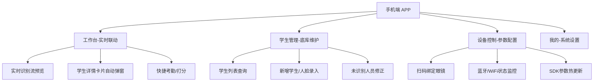

# AR 智慧课堂助手 - 手机端 APP 需求规格说明书 (PRD)

**版本号**: v1.0

**适用平台**: Android (主推，适配 Rokid 生态) / iOS

**配套硬件**: Rokid CXR-M / CXR-S AR 眼镜

## 1. 引言

### 1.1 编写目的

本文档旨在明确“AR 智慧课堂助手”手机端 APP 的功能需求、交互逻辑及数据接口规范。该 APP 并非独立的教务管理软件，而是 AR 眼镜的**控制中枢**与**第二显示屏**，核心解决眼镜端输入不便、显示面积有限的问题。

### 1.2 产品定位

- **连接器**：建立 AR 眼镜与后端服务器的安全通道（在 WiFi 不稳定时作为热点网关）。
- **扩展屏**：当眼镜识别出学生身份时，APP 自动展示该学生的详细全息档案（成绩、画像等）。
- **控制器**：远程配置眼镜端的 SDK 参数（如采集频率、识别阈值）。
- **录入端**：负责学生人脸数据的采集与底库更新。

## 2. 功能架构

APP 主要包含四大核心模块：**工作台 (Live)**、**学生管理 (Database)**、**设备控制 (Device)**、**我的 (Profile)**。



## 3. 详细功能需求

### 3.1 核心模块：工作台 (Live Dashboard)

此模块是上课时的常驻页面，通过 WebSocket 与后端/眼镜端保持长连接。

#### 3.1.1 实时识别流 (Feed Stream)

- **功能描述**：以时间轴形式，实时显示眼镜端成功识别到的学生记录。
- **UI 元素**：
  - **顶部状态栏**：显示“眼镜已连接 (电量 80%)”、“服务延时 45ms”。
  - **时间轴列表**：每当眼镜“咔嚓”识别一人，列表顶部新增一条记录。
    - *内容*：学生头像(抓拍图)、姓名、识别时间、置信度(98%)。
  - **自动定位**：最新识别的学生会自动高亮，并触发底部卡片弹起。

#### 3.1.2 详情联动卡片 (Detail Card)

- **触发机制**：
  1. **自动触发**：眼镜端识别成功 -> 后端推送到手机 -> APP 自动弹出。
  2. **手动触发**：点击时间轴上的某条记录。
- **展示内容**（解决眼镜端显示不下的痛点）：
  - **基础信息**：学号、高清证件照、班级。
  - **学情画像**：近三次考试成绩趋势图（折线图）、作业提交率。
  - **行为标签**：偏科、课堂活跃、需关注（高亮红色）。
- **快捷操作**：
  - [ 记笔记 ]：输入关于该学生的课堂表现文字。
  - [ 加/减分 ]：一键记录课堂表现分。

### 3.2 辅助模块：学生管理 (Student Manager)

#### 3.2.1 未知人员修正 (Unknown Person Handling)

- **场景**：眼镜端显示“黄色框-未识别”，APP 收到一张陌生人脸抓拍图。
- **操作流程**：
  1. APP 收到“未知人员”推送，标记为待处理。
  2. 教师点击该抓拍图，选择“关联已有学生”或“注册新学生”。
  3. **关联逻辑**：从花名册选择学生 -> 确认绑定 -> **调用后端接口更新特征库**。

#### 3.2.2 人脸底库录入 (Face Enrollment)

- **功能**：利用手机高清摄像头录入学生人脸，比眼镜端录入更稳定。
- **流程**：
  - 进入学生详情 -> 点击“更新人脸” -> 调用手机相机。
  - **质量检测**：APP 端需集成轻量级 SDK 判断光线、角度、遮挡。
  - **上传**：压缩图片至 <500KB 上传至后端提取特征。

### 3.3 支撑模块：设备控制 (Device Control)

#### 3.3.1 设备绑定与连接

- **扫码配对**：扫描眼镜包装盒或镜腿上的二维码（包含 DeviceId, Mac地址）。
- **连接状态**：
  - **心跳检测**：每 30s 检查一次眼镜在线状态。
  - **网络中继**：(可选) 若教室 WiFi 差，开启“手机热点模式”，引导眼镜连接手机热点。

#### 3.3.2 SDK 参数热配置 (SDK Config)

- **功能**：远程修改眼镜端 App 的运行参数，即时生效（无需重启眼镜）。
- **配置项**：
  - **采集模式**：[ 自动连续(间隔2s) ] / [ 手动触发 ] / [ 仅检测不识别 ]。
  - **图像质量**：[ 720P (流畅) ] / [ 1080P (清晰) ]。
  - **识别阈值**：[ 高(>95%) ] - 防误报 / [ 中(>85%) ] - 易识别。
  - **反馈音效**：[ 开启 ] / [ 静音 ]。

## 4. 交互设计与 UI 规范

### 4.1 首页 (工作台) UI 布局

- **设计风格**：深色模式 (Dark Mode)，减少上课时手机屏幕光线对老师的干扰，且省电。
- **布局逻辑**：
  - **上半部分 (40%)**：历史识别流（列表），淡化处理。
  - **下半部分 (60%)**：当前学生详情卡片（Card），重点高亮，字号加大（方便放在讲台上瞥视）。

### 4.2 消息推送策略

- **App 内推送**：使用 WebSocket，无感刷新，无系统通知栏打扰。
- **系统级通知**：仅在“设备断开连接”或“电量低于 20%”时发送系统震动通知。

## 5. 接口与数据要求

### 5.1 通信协议

- **WebSocket**：`/ws/teacher/{teacherId}`

  - **下行消息 (Server -> App)**：

    ```
    {
      "type": "IDENTIFY_RESULT",
      "data": {
        "studentId": "2024001",
        "name": "张三",
        "score": 98.5,
        "tags": ["活跃", "数学课代表"],
        "captureImgUrl": "http://...",
        "timestamp": 1705028111
      }
    }
    ```

  - **上行消息 (App -> Server -> Glass)**：

    ```
    {
      "type": "UPDATE_CONFIG",
      "targetDevice": "ROKID_CXR_01",
      "config": {
        "captureInterval": 3000,
        "minFaceSize": 100
      }
    }
    ```

### 5.2 性能指标

- **端到端延迟**：从眼镜抓拍到手机弹窗，需控制在 **1.5秒** 以内（需优化图片传输大小）。
- **并发处理**：APP 需处理每分钟约 20-30 次的识别推送，UI 不得卡顿。

## 6. 开发注意事项

1. **后台保活**：由于老师上课时手机可能锁屏，APP 需申请**后台运行权限**和**WakeLock**，确保 WebSocket 不断连。
2. **图片缓存**：学生证件照应在本地建立 LRU 缓存，避免每次弹窗都重新下载图片。
3. **异常处理**：若 WebSocket 断开，UI 顶部需显示红色横条提示“连接中断，点击重试”，并尝试自动重连。