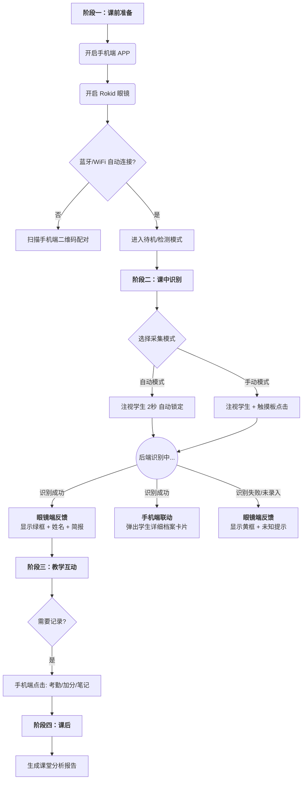

# AR 智慧课堂识别系统 - 交互流程与 UI 设计方案

## 一、 用户使用全流程设计 (User Journey)

本流程设计旨在最小化教师的操作负担，形成“所见即所得”的体验。

### 1.1 核心流程图 (Mermaid)

### 1.2 详细场景描述

1. **准备阶段（配对与握手）**
   - 教师打开手机 APP，进入“上课模式”。
   - 佩戴 Rokid 眼镜，眼镜启动后通过 SDK 自动检索手机服务端。
   - *UI 表现*：眼镜右上角显示 “WiFi 已连接” Icon。
2. **识别阶段（采集与反馈）**
   - **场景**：老师看向一名学生。
   - **CXR SDK 动作**：调用摄像头流，检测人脸 ROI (Region of Interest)。
   - **视觉反馈**：
     - **检测中**：人脸周围出现白色虚线框（跟随头部移动）。
     - **锁定/上传**：线框变为 **蓝色实线**，并有“咔嚓”微声效（骨传导），提示已抓拍发送。
     - **识别结果**：
       - *成功*：线框变 **绿色**，头顶悬浮显示“张三 (98%)”。同时手机震动，屏幕顶层显示张三的完整信息。
       - *陌生人*：线框变 **黄色**，显示“未录入”。
3. **多端联动（第二屏扩展）**
   - 眼镜屏幕空间有限，且出于安全考虑不能遮挡视线。
   - **策略**：当眼镜识别出“张三”时，手机 APP 自动跳转或弹窗显示张三的：*上次作业成绩、近期违纪记录、性格标签*。老师低头看手机即可获取深层信息。

## 二、 眼镜端用户界面设计 (AR HUD Design)

Rokid CXR 系列的分辨率较高，但设计应遵循 **"Less is More"** 原则，避免造成视觉干扰（Information Overload）。所有 UI 元素应使用高对比度颜色。

### 2.1 界面布局 (HUD Layout)

界面分为三个层级：

1. **系统状态层 (System Bar)** - 位于视野最顶端，常驻但半透明。
2. **增强现实层 (AR Layer)** - 动态跟随人脸位置。
3. **操作提示层 (Toast/Snackbar)** - 位于视野底部，仅在操作时出现。

#### 视觉设计示意：

| 区域              | 元素         | 样式/颜色                | 逻辑                                      |
| ----------------- | ------------ | ------------------------ | ----------------------------------------- |
| **顶部状态栏**    | 🔴 录制状态   | 红色圆点                 | 提示摄像头正在工作                        |
|                   | 📶 信号/电量  | 白色图标                 | 确保设备连接正常                          |
|                   | 👥 当前模式   | 文字: "自动采集"         | 提示 SDK 当前的工作流配置                 |
| **中央视野 (AR)** | **人脸框**   | **L型四角框** (非全封闭) | 减少视觉压迫感。白色=寻找，绿色=确认。    |
|                   | **身份标签** | 悬浮文字 (Tag)           | 位于人脸框上方 20px。半透明黑底白字。     |
|                   | **状态图标** | ⏳ / ✔️ / ❌                | 位于人脸框右侧，表示请求处理状态。        |
| **底部提示栏**    | 操作引导     | 简短文字                 | 例如："双击触摸板重录" 或 "数据传输中..." |

### 2.2 关键 UI 状态图解

**状态 A：待机/寻找中 (Scanning)**

> 视野清晰，仅中心有一个极淡的十字准星（辅助对准），当人脸进入视野时，自动吸附。

**状态 B：识别成功 (Identified)**

> **[ 张三 ]** (绿色高亮标签) └── 班级：高二(3)班
>
> *注：仅显示两行最关键信息，停留 3 秒后自动淡出，避免遮挡。*

**状态 C：异常/警告 (Warning)**

> **[ ! 未知人员 ]** (黄色警告色) *提示：请在手机端完善信息*

## 三、 交互逻辑设计 (Interaction)

基于 Rokid 眼镜侧面的触摸板（Touchpad）和头部姿态，定义交互逻辑。

### 3.1 触摸板手势 (Touchpad)

- **单击 (Tap)**：
  - *自动模式下*：强制立即抓拍当前视野中心的人脸（用于补漏）。
  - *手动模式下*：触发采集识别。
- **前后滑动 (Swipe Fwd/Back)**：
  - 调整变焦（如果 SDK/硬件支持）或 切换显示的简报信息页（例如：从"姓名"切换到"考勤状态"）。
- **双击 (Double Tap)**：
  - 触发“高亮模式”或“重置状态”，清除当前视野内的所有标签，重新检测。
- **长按 (Long Press)**：
  - 呼出/隐藏功能菜单（如切换自动/手动模式、校准屏幕）。

### 3.2 手机端联动交互

由于眼镜输入文字困难，所有**编辑/写入**操作均在手机完成：

- **场景**：眼镜显示“未识别”。
- **操作**：老师在手机端点击“刚刚抓拍的照片”，选择“注册新学生”或“关联已有学生”，输入信息保存。
- **同步**：手机端保存后，触发后端更新特征库，眼镜端 3秒内自动更新缓存，该同学头顶标签变为绿色。

## 四、 给开发团队的建议 (基于 CXR SDK)

1. **UI 渲染方式**：建议使用 Android 原生 View 绘制 HUD（通过 Presentation 或 SDK 提供的 UI 容器），而不是使用 Unity，这样能降低功耗并减小安装包体积，且更容易与 Android 手机端通信。
2. **防抖动设计**：人脸框跟随必须加**平滑滤波算法**。如果只是单纯将 SDK 返回的坐标画框，框会剧烈抖动，导致老师产生眩晕感。建议采用“延迟跟随”或“弹性跟随”策略。
3. **隐私提示**：在 UI 设计时，当摄像头开启时，务必在屏幕内（软件 UI）和屏幕外（硬件 LED，如果支持）都有明确提示，符合教育场景伦理。